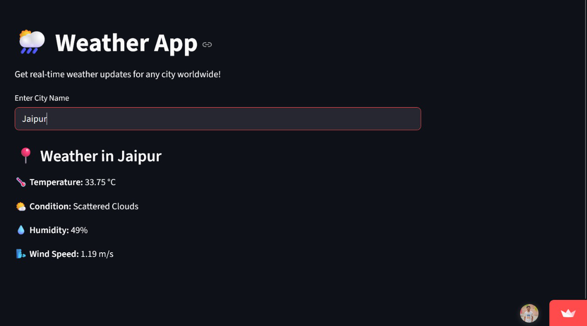

# Weather App

A simple and interactive weather app built with **Python** and **Streamlit**, powered by the **OpenWeatherMap API**.

Get real-time weather updates for any city worldwide — temperature, condition, humidity, and wind speed — all in a beautiful and responsive interface.

---

## Features

- Real-time temperature updates
- Current weather conditions
- Humidity and Wind speed
- Supports any city worldwide
- Live API integration with OpenWeatherMap
- Built using Python and Streamlit for fast and easy deployment

---

## Live App

[Click here to open the live app](https://weather-h7mumm6nb8y4ht5pnwhk9v.streamlit.app)

---

## Tech Stack

- Python 3
- Streamlit
- OpenWeatherMap API
- Requests Library

---

## Screenshot

---
---

## API Key

To use this app:

- Get your free API key from [OpenWeatherMap](https://openweathermap.org/api)
- Open `weather_app.py` and replace:
  python
api_key = "your_api_key_here"

---

## How It Works

- User enters a city name into the app  
- The app sends a request to the OpenWeatherMap API  
- The API returns real-time weather data in JSON format  
- The app displays formatted weather information using Streamlit

---

## What I Learned

- Working with third-party APIs (OpenWeatherMap)  
- Fetching and parsing JSON data in Python  
- Building web apps with Streamlit  
- Creating clean, minimal user interfaces  
- Structuring a GitHub project professionally

